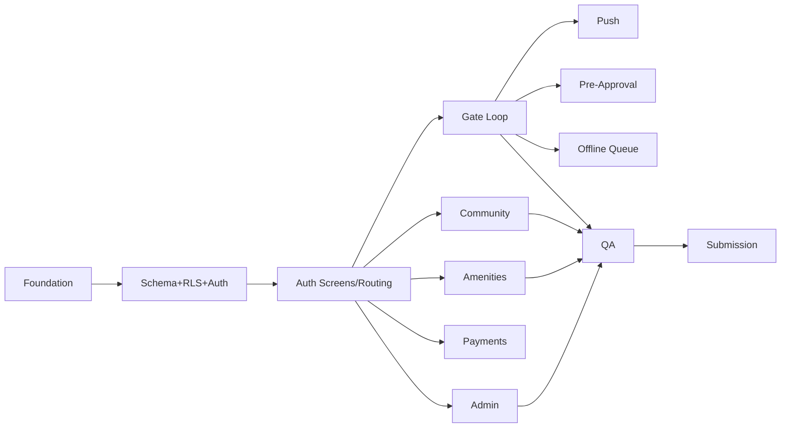

# Angan — Implementation Plan & Todos

Detailed, execution-ready plan derived from [plan.md](plan.md). Work top-to-bottom; each phase gates the next. Checkboxes are the source of truth for progress.

**Legend:** `P0` = must be flawless · `P1` = important, cut before compromising P0 · `P2` = deferred.

**Golden path to protect at all costs:** guard registers visitor → resident approves in real time → guard marks entry/exit → admin sees it scoped to their society.

---

## Phase 0 — Project Foundation `P0`

**Goal:** A running Expo SDK 55 app with tooling, theming, and CI-friendly structure.

- [ ] Init Expo SDK 55 app with TypeScript (RN 0.83, React 19.2, Node 20.19+); confirm SDK is pinned, do not bump.
- [ ] Add Expo Router (file-based) with route groups `(auth)`, `(resident)`, `(guard)`, `(admin)`.
- [ ] Install & configure NativeWind v4 + `tailwind.config.js`; verify against RN 0.83.
- [ ] Add Reanimated + Gesture Handler + `@gorhom/bottom-sheet`; wire Babel/metro config.
- [ ] Add TanStack Query provider + Zustand stores scaffold (`auth`, `theme`, `offline`, `notifications`).
- [ ] Add React Hook Form + Zod.
- [ ] Create design tokens (colors, spacing, radius, typography) + light/dark theme + `useTheme` hook.
- [ ] Build shared UI primitives: `Button`, `Input`, `Card`, `Badge`, `Sheet`, `Loading`, `Empty`, `Error`, `Offline`, `Toast`.
- [ ] Set up folder structure per [plan.md §6](plan.md).
- [ ] Add `.env.example`, `.gitignore` (exclude all secrets), ESLint/Prettier, MIT license.
- [ ] Configure EAS (`eas.json`: development, preview, production profiles).

**Exit criteria:** App boots on device/simulator; dark mode toggles; empty route groups navigate.

---

## Phase 1 — Backend: Supabase Schema, RLS & Auth `P0`

**Goal:** Secure multi-tenant backend with auth-to-RLS wiring correct from day one.

### 1a. Schema — `supabase/migrations/001_schema.sql`
- [ ] `societies`, `towers`, `flats`, `profiles` (with `role`, `society_id`, `flat_id`, `expo_push_token`).
- [ ] `visitors` (status enum `pending|approved|denied|inside|exited`, `otp`, `pass_code`, `entry_at`, `exit_at`, `photo_url`, `created_by`).
- [ ] `helpdesk_tickets`, `ticket_comments`.
- [ ] `amenities`, `amenity_slots`, `bookings`.
- [ ] `notices`, `polls`, `poll_options`, `poll_votes`, `staff`, `notifications`.
- [ ] Every table carries `society_id`; add FKs, indexes on `society_id` + status/date lookups.

### 1b. RLS — `supabase/migrations/002_rls.sql`
- [ ] Enable RLS on **all** tables (deny by default).
- [ ] SECURITY DEFINER helpers `auth_society_id()` and `auth_role()`.
- [ ] Resident policies: only own flat data + society-visible content.
- [ ] Guard policies: visitor workflows only; no resident private data.
- [ ] Admin policies: own society only.
- [ ] Verify no policy trusts a client-supplied role.

### 1c. Auth
- [ ] Enable Supabase Auth (email/password + email OTP) as single provider.
- [ ] `profiles` row auto-created on signup (trigger) with default role.
- [ ] `lib/supabase.ts` client with `expo-secure-store` session persistence.
- [ ] `lib/auth.ts` + `store/auth.store.ts`: `signInWithPassword`, `signInWithOtp`, sign-out, session hydrate.
- [ ] `useAuth` hook.

### 1d. Seed — `supabase/seed.sql`
- [ ] 1 society, 2 towers, ~8 flats.
- [ ] Demo users: `resident@angan.app`, `guard@angan.app`, `admin@angan.app` (password `Demo@1234`).
- [ ] Demo visitors, notices, one poll, amenities.
- [ ] (Optional) 2nd society for isolation demo.

**Exit criteria:** Migrations + seed apply cleanly; RLS unit-checked (2nd-society admin sees nothing).

---

## Phase 2 — Auth Screens & Role Routing `P0`

**Goal:** Each role lands on its own dashboard, enforced by real profile role.

- [ ] `(auth)/login.tsx` — email/password + "email OTP" option (RHF + Zod).
- [ ] `(auth)/otp.tsx` — OTP entry + verify.
- [ ] `(auth)/onboarding.tsx` — profile completion (name, flat) for new users.
- [ ] Root layout guard: redirect by `profiles.role`; unauthenticated → `(auth)`.
- [ ] Loading/splash while session hydrates; handle expired session.
- [ ] Tab layouts: Resident (Home·Approvals·Community·Payments·Profile), Guard (Gate·Visitors·History·Alerts), Admin (Dashboard·Residents·Complaints·Notices·Settings).

**Exit criteria:** All 3 seeded accounts log in and route correctly; sign-out returns to login.

---

## Phase 3 — Gate Loop (Demo Centerpiece) `P0`

**Goal:** Real-time guard↔resident approval with entry/exit — the flagship flow.

- [ ] Guard `register.tsx`: form (name, phone, type, purpose, vehicle) + `expo-camera` photo → Storage signed URL.
- [ ] Insert `visitors` row (status `pending`, `created_by`, `society_id`).
- [ ] `useRealtime` / `useVisitors`: subscribe `channel('visitors:'+societyId)` filtered by `society_id` on both devices.
- [ ] Resident approve/deny via `@gorhom/bottom-sheet` + Reanimated swipe → status `approved`/`denied`.
- [ ] Guard live queue (Gate tab) updates in real time.
- [ ] Guard "Mark Entry" (`entry_at`, status `inside`) and "Mark Exit" (`exit_at`, status `exited`).
- [ ] Guard "Visitors inside" tab from `status='inside'`.
- [ ] Visitor history/search — `@shopify/flash-list`, paginated, filters (Guard History).

**Exit criteria:** End-to-end register→approve→entry→exit works live across two devices in under a few seconds.

---

## Phase 4 — Push Notifications `P1`

**Goal:** Server-driven push on approval-relevant events, with in-app Realtime fallback.

- [ ] `lib/notifications.ts` + `useNotifications`: request permission, save `expo_push_token` to `profiles`.
- [ ] Edge Function `send-push-notification` (Expo Push API).
- [ ] DB trigger on `visitors` insert (pending) → invoke `send-push-notification` to resident.
- [ ] Notice publish → push to society residents.
- [ ] Handle notification tap → deep link to approval sheet.
- [ ] Requires dev/EAS build (not Expo Go) — document this.

**Exit criteria:** Resident receives push for a new visitor and can approve from it.

---

## Phase 5 — Pre-Approval OTP / QR `P1`

**Goal:** Residents pre-authorize guests; guards verify offline-friendly passes.

- [ ] Resident pre-approval: create `approved` visitor row with 6-digit `otp` + random `pass_code`.
- [ ] Generate QR via `react-native-qrcode-svg`; shareable pass screen.
- [ ] Guard verify: scan QR / enter OTP → RPC `verify_pass` (checks society + not-expired + not-used) → status `inside`.
- [ ] Handle invalid/expired/used pass errors.

**Exit criteria:** Pre-approved guest pass verifies and flips to `inside` in one guard action.

---

## Phase 6 — Offline Guard Queue `P0`

**Goal:** Guard never loses a registration when connectivity drops.

- [ ] `store/offline.store.ts`: persist failed inserts (`expo-sqlite`/AsyncStorage).
- [ ] `@react-native-community/netinfo` reconnect detection.
- [ ] `useOfflineSync`: flush queue in original order on reconnect.
- [ ] Pending badge + offline banner UI.

**Exit criteria:** Register in airplane mode → reconnect → row syncs, badge clears, order preserved.

---

## Phase 7 — Community: Notices, Polls, Helpdesk `P0`

**Goal:** Society communication and resident support flows.

- [ ] Notices list (pinned + categories); admin publish (triggers push).
- [ ] Polls: display, one vote enforced via unique `(poll_id, profile_id)`, close date, results view.
- [ ] Helpdesk: resident creates ticket (+ optional photo), status timeline.
- [ ] Ticket comments (threaded, Realtime); admin assign to staff.

**Exit criteria:** Resident raises ticket + votes; admin publishes notice + assigns ticket; states handled.

---

## Phase 8 — Amenities & Booking `P0`

**Goal:** Book shared amenities without double-booking.

- [ ] Amenity listing + slot availability (`amenity_slots`).
- [ ] Booking via RPC with row lock / unique constraint (capacity check prevents double-booking).
- [ ] Cancellation frees the slot; booking history.

**Exit criteria:** Concurrent bookings on the same slot cannot both succeed; cancel re-opens slot.

---

## Phase 9 — Payments (Razorpay Test) `P1`

**Goal:** Dues dashboard with verified test-mode payment.

- [ ] `maintenance_dues` + `payment_history`; migration `003_payments.sql`.
- [ ] Resident dues dashboard (outstanding + history via FlashList).
- [ ] Edge Function `create-razorpay-order`.
- [ ] `lib/razorpay.ts` WebView Checkout (test mode).
- [ ] Edge Function `verify-razorpay-payment` — server-side signature verification.
- [ ] On verify: mark due paid + write `payment_history`.
- [ ] Admin RPC to bulk-generate monthly dues.

**Exit criteria:** Test payment completes, signature verified server-side, due marked paid.

---

## Phase 10 — Admin Console `P0`

**Goal:** Society management scoped strictly to the admin's own society.

- [ ] Manage towers, flats, residents (invite/assign), staff directory.
- [ ] Manage amenities, notices, polls.
- [ ] Complaints: view + assign to staff + status.
- [ ] Dashboard metrics: residents, open complaints, visitors inside, dues collected (`dashboard_stats` view/RPC).
- [ ] Quick actions: publish notice, generate dues, resolve complaint.

**Exit criteria:** Admin operates only within own society; 2nd-society data never visible.

---

## Phase 11 — QA, Hardening & States `P0`

**Goal:** Every screen handles the unhappy paths.

- [ ] Loading / empty / error / offline / dark states on all lists & forms.
- [ ] Haptics + toasts on key actions.
- [ ] Data-isolation test: second society admin sees nothing (record for demo).
- [ ] RLS negative tests (guard cannot read resident private data, etc.).
- [ ] Secret hygiene audit: no keys committed; `.env.example` only; EAS + Edge secrets set.
- [ ] Performance pass on FlashList screens + Realtime subscriptions cleanup.

**Exit criteria:** No unhandled states; isolation proven; no secrets in repo.

---

## Phase 12 — Submission Package

**Goal:** Everything the hackathon requires, verified.

- [ ] Public GitHub repo (MIT, `.env.example` only).
- [ ] EAS `preview` APK + QR install link.
- [ ] README: setup, env, migrations/seed, run + build steps.
- [ ] Demo video (2–3 min): register → approve → entry/exit → dues → admin.
- [ ] Screenshots: light + dark, one per role + real-time approval flow.
- [ ] Demo credentials documented (`Demo@1234`).

**Exit criteria:** All artifacts produced and verified against [Definition of Done](plan.md#10-definition-of-done).

---

## Dependency Order (critical path)

## Guardrails (do not violate)

- Expo SDK 55 is **pinned** — never bump.
- Supabase Auth is the **only** identity provider; RLS authorizes via `auth.uid()`.
- `society_id` is the isolation boundary on every table; RLS is the authorization layer — never trust client role checks.
- Product name is **Angan** everywhere.
- Never commit Razorpay / Supabase service-role / any API keys.
- Cut P1 before ever compromising the P0 gate loop.
